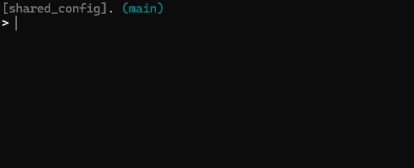
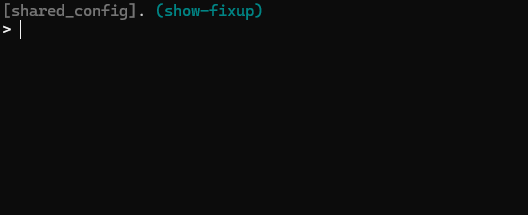

# Workflow general idea
- This workflow is optimized for working on a large repo with frequent updates
- `main` branch is always up-to-date
- Only used branches are fetched
- `main` branch is almost never checked out  

All aliases referred here are defined in [.gitconfig](.gitconfig).

A lot of alias I use depends on [fzf](https://github.com/junegunn/fzf). 

# How-to
## Basics
### Rebase on Main
`git rbm` will update the main branch, then rebase the current one on it.  
*This allows us to keep main branch up-to-date*

### Change branch
`git swf` will show all branches in `fzf` and switch to the selected one.  
`git sw` aliases to `switch`, `git sw -` goes back to previous branch.

 

### Create a new local branch
`git nbr` will update `main` and create a new branch from it.  
`git fbr` will fetch an existing branch on the remote. 

### Add files to staging area
`git amf` opens `fzf` to show modified files, selected files are added to the staging zone.
*You can select multiple entries in `fzf` with the TAB key by default*

### Open modified files
`git omf` opens `fzf` with all files that were modified since current branch diverged from `main`. Selected files are opened in vscode. 

## Modify history
### Quick amend 
`git ame` amends last commit with what's in the staging area. *Can be used with `-a` to add all modified files.*  
`git amne` does the same but skip commit message edition.

### Amend specific commit
`git fix` opens fzf with all commits added since diverging from main, and creates a fixup commit with what's in the staging area. *Can be used with `-a` to add all modified files.*  
`git afix` applies pending fixup commits.  

🍷 This is separated in two operations on purpose, so I can easily fix errors on fixup creation.

### Reorder or modify ongoing work
`git rba` starts an interactive rebase with all commits from merge-base to HEAD.

### Cancel last commit
`git pop` resets on the previous commit.  
*Can be used with `--hard` to discard modifications, works with other `reset` options*

## Bonus

### Work in progress

## Utilities
Some aliases are utilities for others.
- `get-main-branch` redirects to `main` or `master` depending on the repo
    - this page will refer to `main` where this alias is used
- `get-reference-commit` points to the merge-base with `main` branch